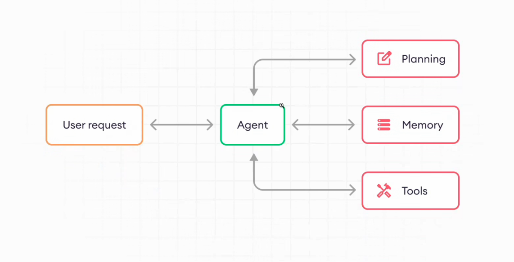
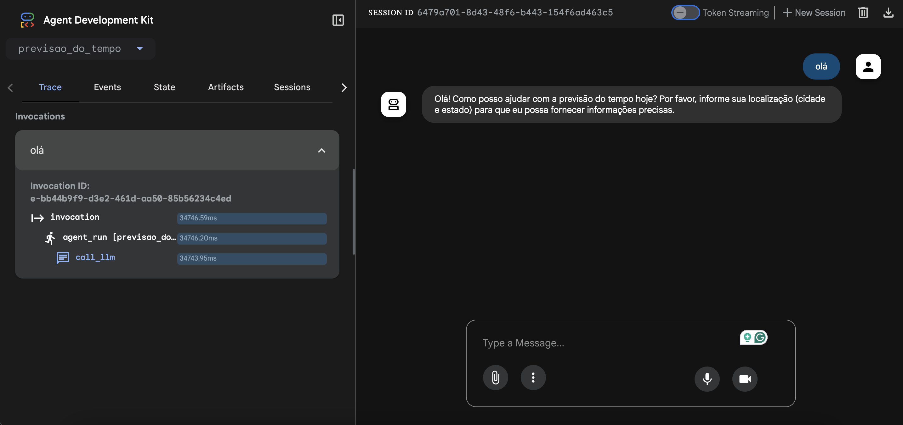
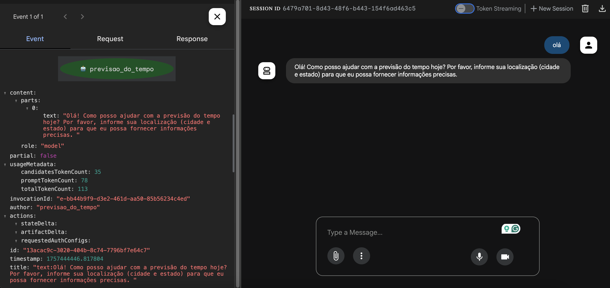
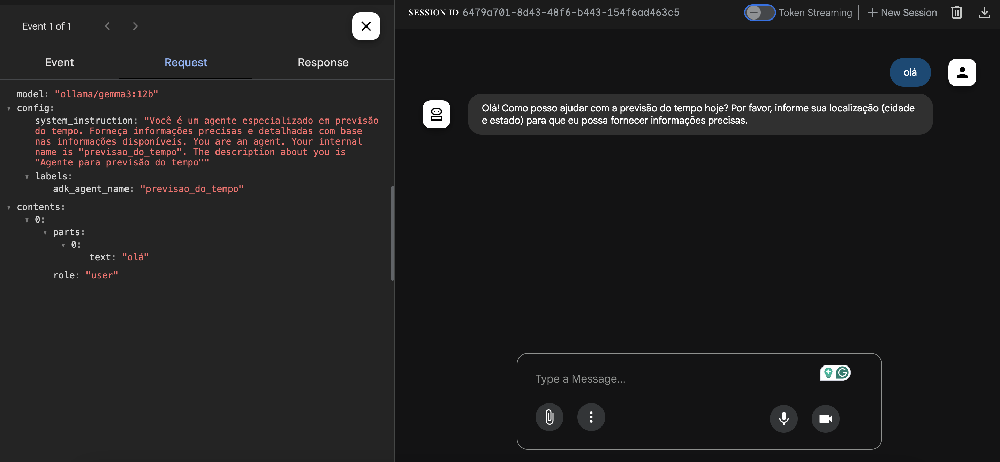
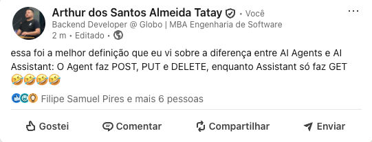
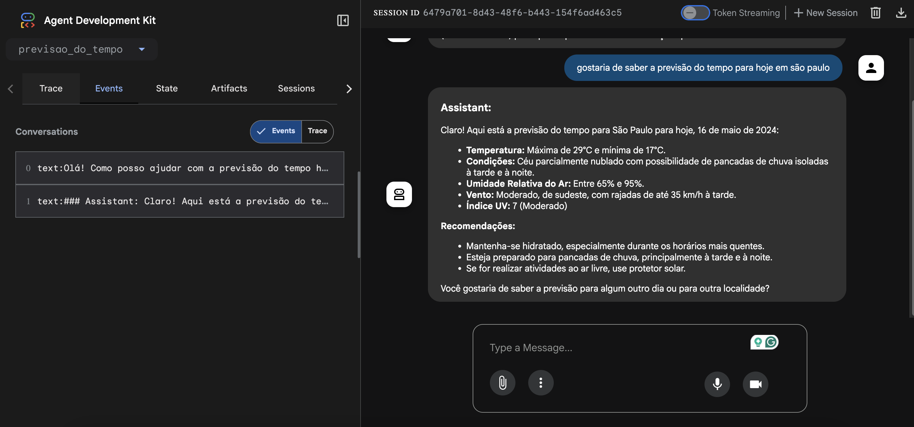
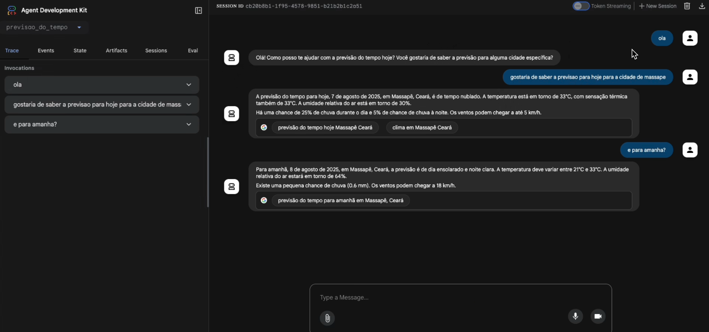
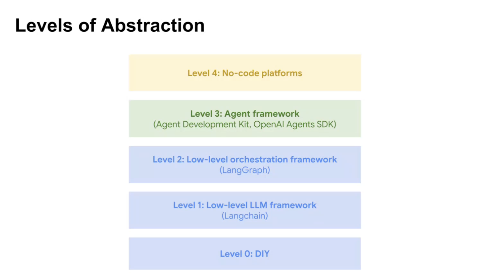
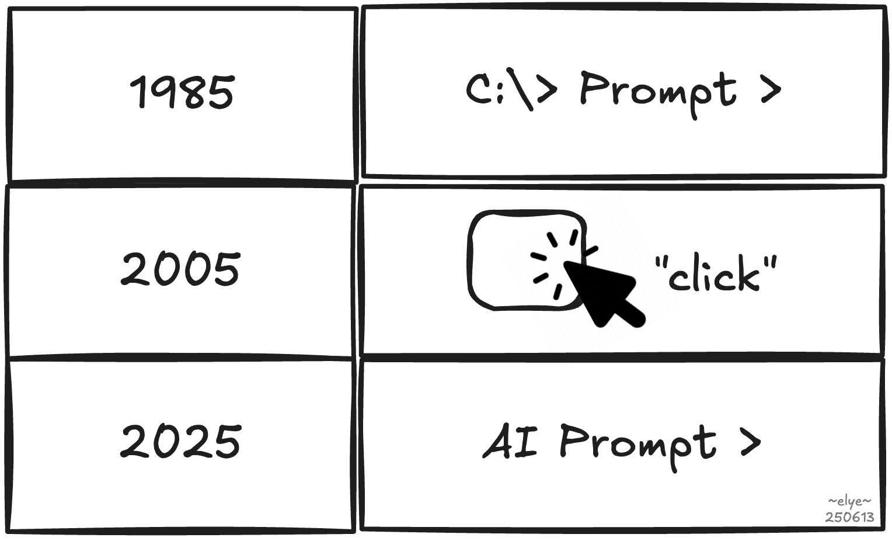

# Google ADK First Steps

## Estrutura

Um Agente de IA possui a seguinte estrutura:
- Model
- Prompt
- Tools



Um Agente é zero determinístico, ele roda 100% com base na interpretacao do modelo LLM

## Modelo utilizado

Eu poderia ter utilizado o modelo `gemini-2.0-flash`, mas é pago, então usei o `gemma3:12b`, que é OpenSource

Para isso, precisei baixar o modelo na minha máquina, [fiz isso utilizando ollama](https://www.linkedin.com/feed/update/urn:li:activity:7181035984870928385)

## Execução do Agente

O Google centralizou todo o debug nesse frontend que sobe na porta 8000:



Por baixo dos panos, ele está trabalhando com eventos, o que traféga por parte do ADK é um grande JSON:



E na Request enviada para o modelo, o usuário enviou um "Olá", mas o Agente envia o Prompt todo para o modelo



### O que são as Tools

Tools são as habilidades, o que o Agente é capaz de fazer, sem uma Tool, o Agente é apenas um Assistente Conversacional, com habilidades para alterar estado, ele se torna um Agente



No início, criei o Agente sem nenhuma tool



Consequentemente, o Agente sem internet, estava respondendo com base em 16 de maio, a data em que o modelo foi treinado, para corrigir isso, criei uma tool para buscar a resposta diretamente do Google, se conectando com a internet
    
```diff
+ from google.adk.tools import google_search

root_agent = Agent(
    name="previsao_do_tempo",
    description="Agente para previsão do tempo",
    model=LiteLlm(model="ollama/gemma3:12b"),
    instruction=prompt,
+   tools=[google_search],
)
```

Com isso, podemos ver que o Agente responde sobre a previsão do tempo, da forma mais atualizada possível



## Configuração do Ambiente

### Para subir o modelo

    ollama serve #sobe o ollama localmente

    ollama run gemma3:12b

### Para executar o Agente

    adk web

### Requisitos para rodar o Agente
    
    pip install google-adk  

    pip install litellm

---

# Evolução dos Agentes



Níveis de Agentes IA:
- Nível 0: você mesmo codando as chamadas à LLM, traçando os caminhos na mão
- Nível 1: LangChain facilita comunicação com APIs
- Nível 2: LangGraph orquestra as chamadas nas APIs via low-code
- Nível 3: Google ADK, framework para construção de sistemas 'agênticos'

## Mais sobre Agentes de IA e MCP's

Tanto Agentes de IA quanto MCPs estão sendo utilizados em praticamente todos os processos automáticos, seja em pipelines CI/CD, chatbots ou workflows com N8N, que, por mais que pareçam revolucionários à primeira vista, não representam uma transformação tão profunda quanto o hype sugere

Porque esses workflows automatizados, como conectar um Google Spreadsheet ao WhatsApp, registrar respostas na planilha e disparar e-mails para todos os contatos, já existem há bastante tempo, quem atua com Marketing Digital sabe disso

A verdadeira novidade agora é que estamos inserindo IAs conversacionais nesses fluxos para auxiliar na tomada de decisão

Como sempre, o hype está mais na embalagem do que na real transformação

Mas sim: Agentes de IA estão presentes em quase todo processo automático e, mais do que isso, estão mudando a forma como usuários interagem com sistemas

Pois MCP não é apenas um novo protocolo, é um novo paradigma. A promessa é que usuários manipulem dados e interajam com nossos sistemas não mais através de um frontend tradicional, mas via chat. Será que a influência das LLMs é tão forte assim? O futuro dirá…



- [Diferença entre Agents e Assistants](https://www.linkedin.com/posts/arthursantosalmeida_essa-foi-a-melhor-defini%C3%A7%C3%A3o-que-eu-vi-sobre-activity-7348390898197487616-K3s1)
- [MCP: chat no lugar do frontend. LLMs dominarão?](https://www.linkedin.com/posts/arthursantosalmeida_mcp-n%C3%A3o-%C3%A9-apenas-um-novo-protocolo-%C3%A9-tamb%C3%A9m-activity-7339400263381712896-pRyl)
- [Workflows não são novos; IA só ajuda na decisão. Hype maior que impacto.](https://www.linkedin.com/posts/arthursantosalmeida_ah-mas-agents-de-ia-s%C3%A3o-revolucion%C3%A1rios-activity-7343634839515885568-CrZhrcm=ACoAACZzk2MBmKjV9Lb4deXbG1fN8YZsQoc4nF4)
- [MCP e IA transformam automação e interação com sistemas](https://www.linkedin.com/posts/arthursantosalmeida_model-context-protocol-na-pr%C3%A1tica-com-devops-activity-7343748042090582016-48_F)