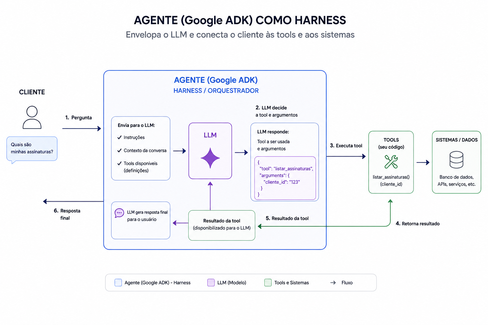

# Operador de Conta

Agente de atendimento de conta construído com o **Google ADK (Agent Development Kit)**.

O agente atua como atendente da Acme e é capaz de:
- Consultar os dados da assinatura do cliente (plano, status e data de renovação)
- Listar e tirar dúvidas sobre as faturas do cliente
- Cancelar a assinatura do cliente

## Referências

- **Fundamentos do Google ADK:** https://github.com/DeveloperArthur/google-adk-first-steps/tree/main#google-adk-first-steps
- **Tutorial seguido para desenvolver este agente:** https://www.youtube.com/watch?v=V3Mtur9JuKY

## O que é Harness? 

O Harness pode ser comparado a uma IDE, ele gerencia o ambiente no qual a LLM executa, nesse sentido, o Google ADK também é um harness, ele envolve o modelo para transformá-lo em um agente autônomo



Mas se levarmos em conta apenas essa descrição, iremos chegar na conclusão que Claude Code e Codex também são Harness, pois são apps que encapsulam a LLM

E podemos ir mais longe ainda, [chatgpt.com](chatgpt.com) e [claude.ai](claude.ai) também são harness, são meios de interagir com a LLM através do frontend, ou seja: **tudo é harness**...

Se você não estiver interagindo com uma LLM diretamente, você está utilizando um harness... Mas existe o conceito de Harness Engineering...

### Harness Engineering

No sentido mais amplo, harness é uma camada que envolve/intermedeia a interação com o modelo, mas no contexto de Harness Engineering a ideia seria construir um ambiente de execução com restrições, ferramentas, contexto, feedback e mecanismos de controle que permitam que um modelo autônomo opere de maneira confiável

Quando alguém diz que está utilizando Claude Code + Harness, significa que a pessoa configurou o Claude Code com uma estrutura de controle para ter garantia de qualidade, controle de acessos, quais ferramentas o agente pode utilizar, quais recursos ele pode acessar, quais ações são permitidas ou proibidas etc

### Conclusão

Harness, no sentido mais genérico, é qualquer camada que intermedeia a interação com o modelo. Nesse sentido, ChatGPT, Claude.ai, Codex, Claude Code, SDKs, frameworks como ADK etc. podem ser considerados harnesses.

Harness Engineering é algo mais específico: é projetar deliberadamente o ambiente no qual o agente opera, suas ferramentas, contexto, permissões, restrições, validações, feedback e mecanismos de segurança, para controlar e tornar confiável o comportamento do LLM.

## Como rodar o projeto

### Pelo terminal (conversa no CLI)

A partir da pasta do agente:

```bash
adk run .
```

### Pela interface web

A partir da **pasta pai** (o diretório que contém `operador_conta/`):

```bash
adk web .
```

O ADK sobe um servidor local e imprime a URL no terminal. Abra no navegador e selecione o agente `operador_conta`.

## Pré-requisitos: chave de API

O agente usa um modelo Gemini, então é necessária uma chave de API do Google.

1. Acesse o [Google AI Studio](https://aistudio.google.com) e crie uma chave de API.
2. Exporte a chave como variável de ambiente antes de rodar o agente:

```bash
export GOOGLE_API_KEY=<sua-chave>
```

> A variável precisa estar disponível na mesma sessão de terminal em que o agente for executado.
> Para não precisar exportar toda vez, você pode criar um arquivo `.env` na pasta do agente
> com `GOOGLE_API_KEY=<sua-chave>` — o ADK carrega esse arquivo automaticamente.
> Nunca versione a chave no Git.

## Estrutura

```
operador_conta/
├── agent.py    # definição do root_agent, modelo e registro das tools
├── tools.py    # tools (funções) e os dados mockados de assinaturas e faturas
├── prompt.py   # instruction do agente
└── README.md
```

Os dados de assinaturas e faturas são mockados em memória (`tools.py`), então qualquer alteração —
como o cancelamento de uma assinatura — é perdida ao reiniciar o processo.